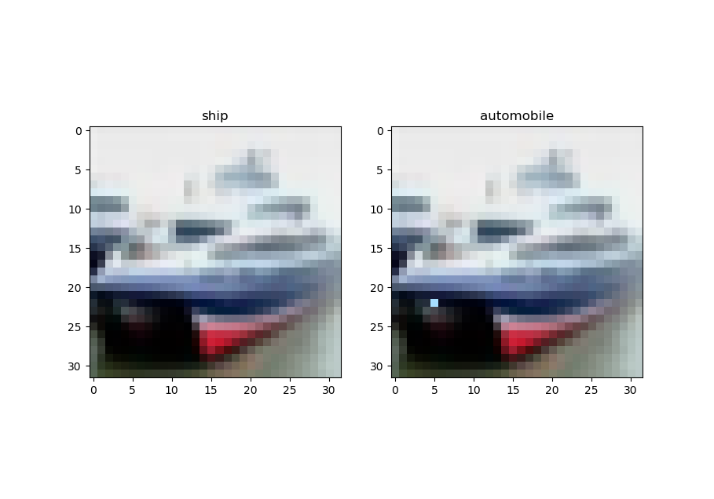

# masterthesis_experiments

In my Masterthesis I try to increase the robustness of convolutional neural networks against one pixel attacks.

The image below shows the result of simple attack using differential evolution. On the left side the original image is printed,
which is correctly identified as a ship. However, on the right side the perturbed image (just one-pixel changed) is shown, which is
classified (with 100% confidence) as automobile.

